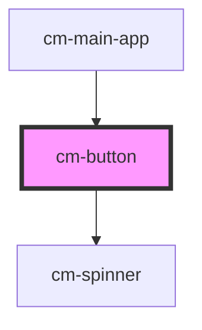

# cm-button

<!-- Auto Generated Below -->

## Properties

| Property    | Attribute    | Description | Type                                                                  | Default     |
| ----------- | ------------ | ----------- | --------------------------------------------------------------------- | ----------- |
| `disabled`  | `disabled`   |             | `boolean`                                                             | `false`     |
| `isLoading` | `is-loading` |             | `boolean`                                                             | `false`     |
| `name`      | `name`       |             | `string`                                                              | `undefined` |
| `type`      | `type`       |             | `"button" \| "reset" \| "submit"`                                     | `'button'`  |
| `value`     | `value`      |             | `string`                                                              | `undefined` |
| `variants`  | `variants`   |             | `"danger" \| "default" \| "ghost" \| "icon" \| "link" \| "secondary"` | `'default'` |

## Events

| Event           | Description | Type                      |
| --------------- | ----------- | ------------------------- |
| `buttonClicked` |             | `CustomEvent<MouseEvent>` |

## Dependencies

### Used by

 - [cm-main-app](../cm-main-app)

### Depends on

- [cm-spinner](../cm-spinner)

### Graph

----------------------------------------------

*Built with [StencilJS](https://stenciljs.com/)*
