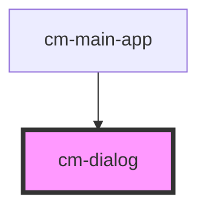

# cm-dialog

<!-- Auto Generated Below -->

## Properties

| Property        | Attribute         | Description | Type      | Default |
| --------------- | ----------------- | ----------- | --------- | ------- |
| `isAlertDialog` | `is-alert-dialog` |             | `boolean` | `false` |

## Events

| Event         | Description | Type                |
| ------------- | ----------- | ------------------- |
| `closeDialog` |             | `CustomEvent<null>` |
| `openDialog`  |             | `CustomEvent<null>` |

## Methods

### `toggleClose() => Promise<void>`

#### Returns

Type: `Promise<void>`

### `toggleOpen() => Promise<void>`

#### Returns

Type: `Promise<void>`

## Dependencies

### Used by

 - [cm-main-app](../cm-main-app)

### Graph

----------------------------------------------

*Built with [StencilJS](https://stenciljs.com/)*
