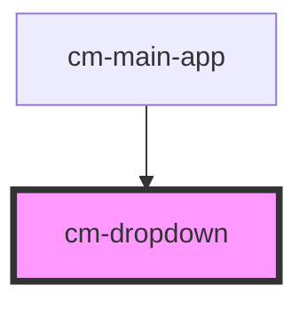

# cm-dropdown

<!-- Auto Generated Below -->

## Properties

| Property        | Attribute        | Description | Type       | Default                                                                                                                                                                                                                                                                                                  |
| --------------- | ---------------- | ----------- | ---------- | -------------------------------------------------------------------------------------------------------------------------------------------------------------------------------------------------------------------------------------------------------------------------------------------------------- |
| `dropdownTitle` | `dropdown-title` |             | `string`   | `'Toggle DropDown'`                                                                                                                                                                                                                                                                                      |
| `itemNames`     | --               |             | `IItems[]` | `[     { item: 'Settings' },     { item: 'Profile' },     { item: 'Notifications', disabled: true },     { item: 'Messages' },     { item: 'Support', disabled: true },     { item: 'Account' },     { item: 'Dashboard' },     { item: 'Logout' },     { item: 'Help' },     { item: 'Feedback' },   ]` |
| `rtl`           | `rtl`            |             | `boolean`  | `false`                                                                                                                                                                                                                                                                                                  |
| `search`        | `search`         |             | `boolean`  | `true`                                                                                                                                                                                                                                                                                                   |

## Events

| Event       | Description | Type                  |
| ----------- | ----------- | --------------------- |
| `itemClick` |             | `CustomEvent<string>` |

## Dependencies

### Used by

 - [cm-main-app](../cm-main-app)

### Graph

----------------------------------------------

*Built with [StencilJS](https://stenciljs.com/)*
