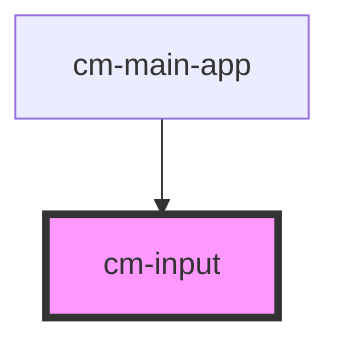

# cm-input

<!-- Auto Generated Below -->

## Properties

| Property       | Attribute      | Description | Type                                                                                                                                                                                                                                                        | Default     |
| -------------- | -------------- | ----------- | ----------------------------------------------------------------------------------------------------------------------------------------------------------------------------------------------------------------------------------------------------------- | ----------- |
| `autocomplete` | `autocomplete` |             | `string`                                                                                                                                                                                                                                                    | `undefined` |
| `autofocus`    | `autofocus`    |             | `boolean`                                                                                                                                                                                                                                                   | `undefined` |
| `class`        | `class`        |             | `string`                                                                                                                                                                                                                                                    | `undefined` |
| `disabled`     | `disabled`     |             | `boolean`                                                                                                                                                                                                                                                   | `undefined` |
| `inputid`      | `inputid`      |             | `string`                                                                                                                                                                                                                                                    | `undefined` |
| `max`          | `max`          |             | `number \| string`                                                                                                                                                                                                                                          | `undefined` |
| `maxlength`    | `maxlength`    |             | `number`                                                                                                                                                                                                                                                    | `undefined` |
| `min`          | `min`          |             | `number \| string`                                                                                                                                                                                                                                          | `undefined` |
| `multiple`     | `multiple`     |             | `boolean`                                                                                                                                                                                                                                                   | `undefined` |
| `name`         | `name`         |             | `string`                                                                                                                                                                                                                                                    | `undefined` |
| `pattern`      | `pattern`      |             | `string`                                                                                                                                                                                                                                                    | `undefined` |
| `placeholder`  | `placeholder`  |             | `string`                                                                                                                                                                                                                                                    | `undefined` |
| `readonly`     | `readonly`     |             | `boolean`                                                                                                                                                                                                                                                   | `undefined` |
| `required`     | `required`     |             | `boolean`                                                                                                                                                                                                                                                   | `undefined` |
| `size`         | `size`         |             | `number`                                                                                                                                                                                                                                                    | `undefined` |
| `step`         | `step`         |             | `number \| string`                                                                                                                                                                                                                                          | `undefined` |
| `type`         | `type`         |             | `"number" \| "color" \| "button" \| "time" \| "image" \| "text" \| "hidden" \| "submit" \| "reset" \| "checkbox" \| "date" \| "datetime-local" \| "email" \| "file" \| "month" \| "password" \| "radio" \| "range" \| "search" \| "tel" \| "url" \| "week"` | `undefined` |
| `value`        | `value`        |             | `string`                                                                                                                                                                                                                                                    | `undefined` |

## Events

| Event         | Description | Type                  |
| ------------- | ----------- | --------------------- |
| `textChanged` |             | `CustomEvent<string>` |

## Dependencies

### Used by

 - [cm-main-app](../cm-main-app)

### Graph

----------------------------------------------

*Built with [StencilJS](https://stenciljs.com/)*
