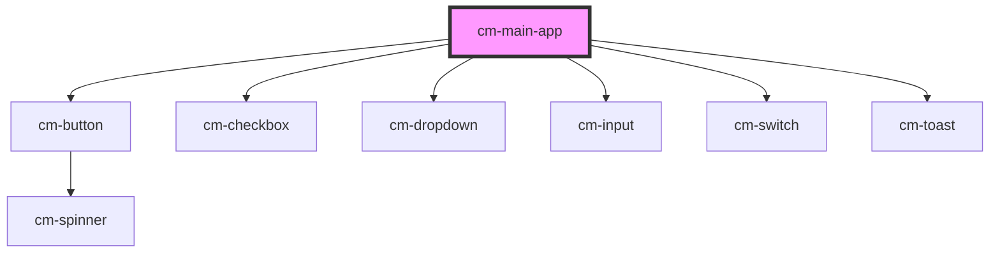

# cm-main-app

<!-- Auto Generated Below -->

## Events

| Event   | Description | Type                                                                                                 |
| ------- | ----------- | ---------------------------------------------------------------------------------------------------- |
| `toast` |             | `CustomEvent<ICustomToast & Partial<IToastWithButton> \| IDefaultToast & Partial<IToastWithButton>>` |

## Dependencies

### Depends on

- [cm-button](../cm-button)
- [cm-checkbox](../cm-checkbox)
- [cm-dropdown](../cm-dropdown)
- [cm-input](../cm-input)
- [cm-switch](../cm-switch)
- [cm-toast](../cm-toast)

### Graph

----------------------------------------------

*Built with [StencilJS](https://stenciljs.com/)*
