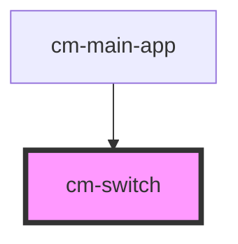

# cm-switch

<!-- Auto Generated Below -->

## Properties

| Property         | Attribute         | Description | Type      | Default     |
| ---------------- | ----------------- | ----------- | --------- | ----------- |
| `checked`        | `checked`         |             | `boolean` | `undefined` |
| `defaultChecked` | `default-checked` |             | `boolean` | `undefined` |
| `disabled`       | `disabled`        |             | `boolean` | `undefined` |
| `name`           | `name`            |             | `string`  | `undefined` |
| `required`       | `required`        |             | `boolean` | `undefined` |
| `value`          | `value`           |             | `string`  | `undefined` |

## Events

| Event           | Description | Type                   |
| --------------- | ----------- | ---------------------- |
| `checkedChange` |             | `CustomEvent<boolean>` |

## Dependencies

### Used by

 - [cm-main-app](../cm-main-app)

### Graph

----------------------------------------------

*Built with [StencilJS](https://stenciljs.com/)*
